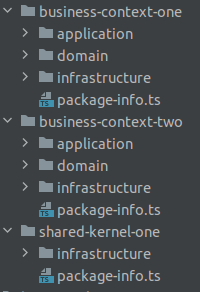

# arch-unit-ts

arch-unit-ts is a free library for checking your typescript architecture. Inspired by [ArchUnit](https://github.com/TNG/ArchUnit) .

This library can check dependencies between packages and classes. The main goal of Arch-Unit-ts is to automatically test architecture and coding rules of your project.

We began to implement functionalities in order to be able to test a hexagonal architecture the same way it is done in [JhipsterLite](https://github.com/jhipster/jhipster-lite/blob/main/src/test/java/tech/jhipster/lite/HexagonalArchTest.java)

<!-- TOC -->

- [How to use](#how-to-use)
  - [Installation](#installation)
  - [Hexagonal Arch Test example](#hexagonal-arch-test-example)
- [How to contribute](#how-to-contribute)
  - [Get project](#get-project)
  <!-- TOC -->

## How to use

I tried to stay as close as I could to ArchUnit. If something is implemented, it should work the same way as the original one.

### Installation

`npm install arch-unit-ts`

### Hexagonal Arch Test example

First, you will need to create two files SharedKernel.ts and BusinessContext.ts.
You can place them at the root of you webapp project.

```
export abstract class SharedKernel {}
```

```
export abstract class BusinessContext {}
```

Then, in each context you have, you will need to add a package-info.ts in the context root folder.
If it's a business context, make it extends BusinessContext.
If it's a shared kernel, make it extends SharedKernel.
The important part is the imports, make sure you import only one of them.

```
import { SharedKernel } from "@/SharedKernel";

class PackageInfo extends SharedKernel {}

/// OR

import {BusinessContext} from "@/BusinessContext";

class PackageInfo extends BusinessContext {}
```

Example of packages:



Then, you can create an HexagonalArchTest.spec.ts.
The path of your source project (folder from which you want to test your architecture) is a relative path starting from your tsconfig.json file.

```
import { TypeScriptProject } from "arch-unit-ts/dist/arch-unit/core/domain/TypeScriptProject";
import { RelativePath } from "arch-unit-ts/dist/arch-unit/core/domain/RelativePath";
import { classes, noClasses } from 'arch-unit-ts/dist/main';
import { SharedKernel } from '@/app/SharedKernel';
import { BusinessContext } from '@/app/BusinessContext';

describe('HexagonalArchTest', () => {
  const srcProject = new TypeScriptProject(RelativePath.of('src/main/app'), '**/*FilesToExclude*', '**/*OtherFilesToExclude*');

  const sharedKernels = packagesWithContext(SharedKernel.name);
  const businessContexts = packagesWithContext(BusinessContext.name);

  function otherBusinessContextsDomains(context: string): string[] {
    return businessContexts.filter((other) => context !== other).map((name) => name + '/domain');
  }

  function packagesWithContext(contextName: string): string[] {
    return srcProject
      .filterClasses('**/package-info.ts')
      .filter((typeScriptClass) => typeScriptClass.hasImport(contextName))
      .map((typeScriptClass) => typeScriptClass.packagePath.get());
  }

  describe('BoundedContexts', () => {
    it.each([...sharedKernels, ...businessContexts])('Should %s not depend on other bounded context domains', (context) => {
      noClasses()
        .that()
        .resideInAnyPackage(context)
        .should()
        .dependOnClassesThat()
        .resideInAnyPackage(...otherBusinessContextsDomains(context))
        .because('Contexts can only depend on classes in the same context or shared kernels')
        .check(srcProject.allClasses());
    });
  });

  describe('Domain', () => {
    it('Should not depend on outside', () => {
      classes()
        .that()
        .resideInAPackage('/domain')
        .should()
        .onlyDependOnClassesThat()
        .resideInAnyPackage('/domain', ...sharedKernels)
        .because('Domain model should only depend on domains and a very limited set of external dependencies')
        .check(srcProject.allClasses());
    });
  });

  describe('Application', () => {
    it('Should not depend on infrastructure', () => {
      noClasses()
        .that()
        .resideInAPackage('/application')
        .should()
        .dependOnClassesThat()
        .resideInAnyPackage('/infrastructure')
        .because('Application should only depend on domain, not on infrastructure')
        .check(srcProject.allClasses());
    });
  });

  describe('Primary', () => {
    it('Should not depend on secondary', () => {
      noClasses()
        .that()
        .resideInAPackage('/primary')
        .should()
        .dependOnClassesThat()
        .resideInAnyPackage('/secondary')
        .because('Primary should not interact with secondary')
        .check(srcProject.allClasses());
    });
  });

  describe('Secondary', () => {
    it('should not depend on application', () => {
      noClasses()
        .that()
        .resideInAPackage('infrastructure/secondary')
        .should()
        .dependOnClassesThat()
        .resideInAPackage('application')
        .because('Secondary should not depend on application')
        .check(srcProject.allClasses());
    });

    it.each([...sharedKernels, ...businessContexts])('should %s not depend on same context primary', (context) => {
      noClasses()
        .that()
        .resideInAPackage(context + '/infrastructure/secondary')
        .should()
        .onlyDependOnClassesThat()
        .resideInAPackage(context + '/infrastructure/primary')
        .because("Secondary should not loop to its own context's primary")
        .check(srcProject.allClasses());
    });
  });
});
```

## How to contribute

I tried as much as I could to stay close to the original ArchUnit code.
If something you would like is missing, check ArchUnit implementation and make a merge request.

### Get project

... Coming soon ...
